本文说明当前项目中“用户通过自然语言提问，LLM 调用 MCP，再驱动 Blender 执行操作”的完整内部流程。

> 代码范围：
>
> - MCP Server：`src/blender_mcp/server.py`
> - Blender Addon：`src/blender_mcp/bundled/addon.py`
> - Addon 安装与版本管理：`src/blender_mcp/addon_manager.py`
> - 安全模式：`src/blender_mcp/safe_mode.py`
> - 程序入口：`main.py`
>
> 本文中的流程图使用 `Mermaid` 语法。支持 Mermaid 的 Markdown 查看器可以直接渲染；不支持时仍可根据节点文字阅读流程。
>
> **图形样式约定：** 流程图使用彩色节点、较粗边框和 `TB`（从上到下）布局；节点文字启用自动换行，长流程会折叠到后续行，避免无限横向延伸。时序图使用不同颜色区分参与者、消息线和说明注释。
>
> **模块配色约定：** 浅蓝表示用户/LLM Client，浅紫表示 MCP Server/Tool，浅青表示 TCP/Socket/Queue，浅橙表示 Blender Addon/主线程/bpy，浅粉表示外部 API/资源，浅绿表示成功结果，浅红表示错误。
>
> **GitHub 兼容性：** GitHub Markdown 原生支持 Mermaid。本文流程图使用较稳定的 `classDef` 和 `class` 语法实现模块配色，并使用 `flowchart TB` 让长流程按上下方向排列。不同 Mermaid 渲染器对自定义 `init` 参数的支持可能不同，因此模块颜色主要依赖流程图的 `classDef`/`class`。

---

## 1. 系统总体架构

系统由两段通信组成：

1. **MCP 协议通信**：LLM Client ↔ MCP Server
2. **内部 TCP/JSON 通信**：MCP Server ↔ Blender Addon

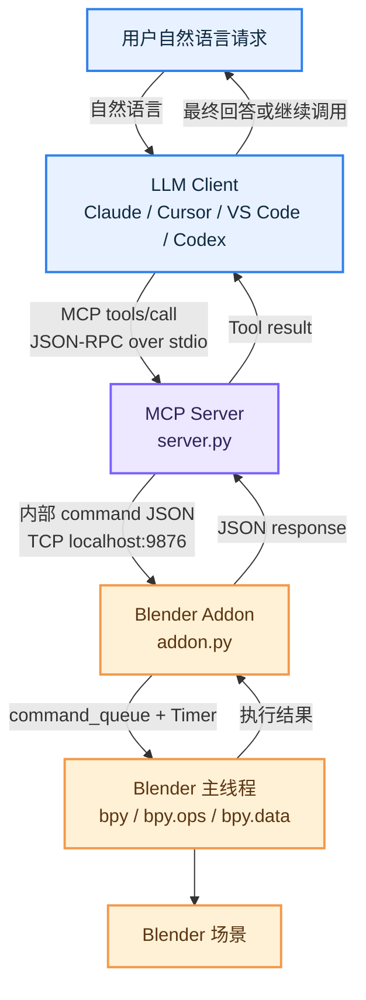

### 1.1 各模块职责

| 模块 | 文件 | 主要职责 |
|---|---|---|
| 程序入口 | `main.py` | 调用 `blender_mcp.server.main()` |
| MCP Server | `src/blender_mcp/server.py` | 注册 MCP Tools/Prompts，处理 MCP 请求，与 Blender 建立持久 TCP 连接 |
| 连接层 | `BlenderConnection` | 将 Tool 调用转成 JSON，通过 Socket 发送并读取完整响应 |
| Blender Addon Server | `BlenderMCPServer` | 在 Blender 内监听 TCP 端口，接收外部命令 |
| 命令队列 | `command_queue` | 将 Socket 线程收到的命令转交 Blender 主线程 |
| 命令分发器 | `_execute_command_internal()` | 按 `command.type` 找到对应处理函数 |
| Blender 执行器 | `execute_code()` 和各类 Handler | 调用 `bpy`、执行脚本、获取场景信息、导入资源等 |
| 安全模式 | `safe_mode.py` | 可选地对 `execute_blender_code` 做 AST allowlist 校验 |
| Addon 管理器 | `addon_manager.py` | 安装 Addon、发现安装目录、协议版本握手 |
| 遥测/轨迹 | `telemetry.py`、`trajectory.py` 等 | 记录工具调用、场景轨迹和用户反馈，受用户同意状态控制 |

---

## 2. 启动流程

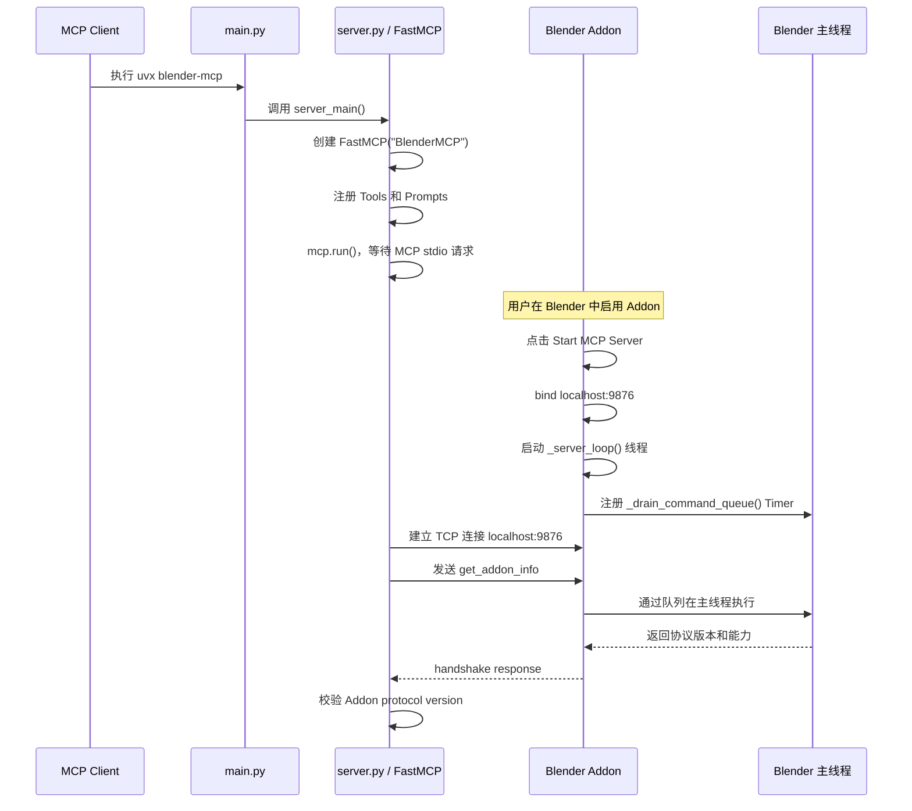

MCP Server 通过 `mcp.run()` 等待 MCP Client 的 stdio 请求；Blender Addon 则在用户点击连接后监听 `localhost:9876`。两端建立 TCP 连接后，Server 会通过 `get_addon_info` 完成协议握手。

### 2.1 MCP Server 入口

`pyproject.toml` 中定义了命令入口：

```toml
[project.scripts]
blender-mcp = "blender_mcp.server:main"
```

`main.py` 只是一个包装入口：

```python
from blender_mcp.server import main as server_main


def main():
    server_main()
```

真正的启动逻辑位于 `src/blender_mcp/server.py`：

```python
mcp.run()
```

`FastMCP` 负责 MCP 协议层的初始化、工具注册、请求解析和响应封装。

### 2.2 Blender Addon 入口

Blender 中点击连接按钮后，执行：

```python
BLENDERMCP_OT_StartServer.execute()
```

该函数创建并启动：

```python
bpy.types.blendermcp_server = BlenderMCPServer(
    port=scene.blendermcp_port
)

bpy.types.blendermcp_server.start()
```

Addon 默认监听：

```text
host: localhost
port: 9876
```

Addon 不支持 `blender -b` 后台模式，因为后台模式没有正常的 Blender UI 主线程事件循环，命令队列无法按照预期执行。

---

## 3. 用户提问到 Tool 调用流程

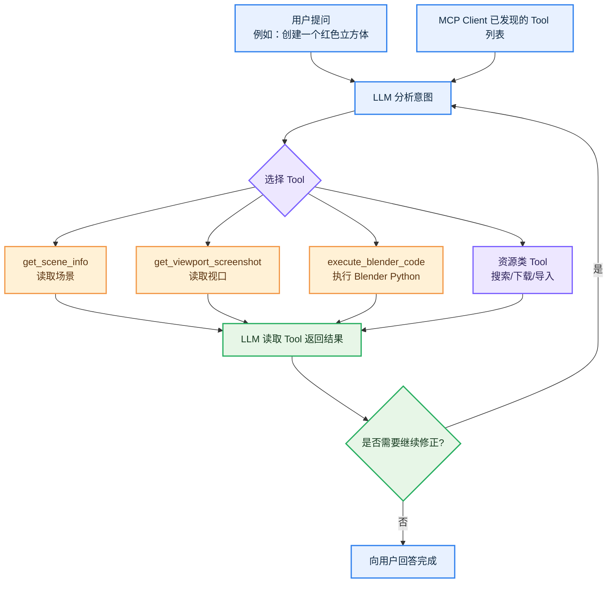

用户的自然语言不会直接发送给 Blender。LLM 会根据 MCP Server 暴露的 Tool 名称、参数 Schema 和 docstring，判断应调用哪个工具，并根据返回结果决定是否继续观察或修正。

---

## 4. MCP Server 到 Blender Addon 的 TCP/JSON 流程

MCP Tool 内部通过 `get_blender_connection()` 获取持久连接，然后调用：

```python
blender.send_command(command_type, params)
```

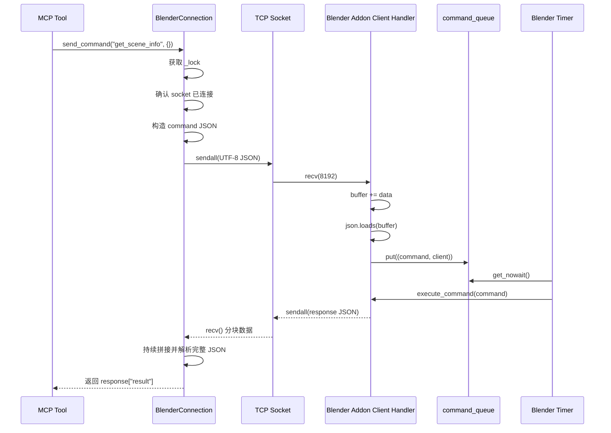

Server 发送的内部命令格式为：

```json
{
  "type": "get_object_info",
  "params": {
    "name": "Cube"
  }
}
```

执行 Blender Python 时：

```json
{
  "type": "execute_code",
  "params": {
    "code": "import bpy\n..."
  }
}
```

内部 TCP 协议目前依赖请求/响应顺序，没有显式的 command ID。为防止多个请求在同一个 TCP 流中交错，`BlenderConnection.send_command()` 使用 `_lock` 将发送和接收整体串行化。

---

## 5. Blender Addon 的线程模型

```mermaid
flowchart TB
    SS[Addon Socket Server\n_server_loop 线程]
    AC[客户端处理线程\n_handle_client]
    Q[queue.Queue\ncommand_queue]
    BT[Blender 主线程 Timer\n_drain_command_queue]
    EX[execute_command]
    BP[bpy 数据/API]
    RESP[client.sendall(response)]

    SS -->|accept()| AC
    AC -->|解析完整 JSON| Q
    Q -->|每 0.05 秒取出| BT
    BT --> EX
    EX --> BP
    BP --> EX
    EX --> RESP

    classDef transport fill:#E3F8F1,stroke:#16A085,stroke-width:2px,color:#123B32;
    classDef blender fill:#FFF1D6,stroke:#F2994A,stroke-width:2px,color:#5C3512;
    classDef result fill:#E7F6E7,stroke:#27AE60,stroke-width:2px,color:#173B20;
    class SS,AC,Q,BT transport;
    class BP blender;
    class EX,RESP result;
```

Socket 线程只负责接收并解析 JSON，然后将命令放入 `command_queue`。真正访问 `bpy` 的操作由 Blender 主线程的 Timer 执行，从而避免在网络线程中直接调用 Blender API。

---

## 6. Blender 命令分发流程

```mermaid
flowchart TB
    C[command JSON]
    P[读取 command.type 和 command.params]
    Ping{type == ping?}
    H[构造 handlers 映射]
    E{集成是否启用?}
    B[基础 Handler]
    PH[Poly Haven Handler]
    SK[Sketchfab Handler]
    PP[Poly Pizza Handler]
    H3[Hyper3D Handler]
    HY[Hunyuan3D Handler]
    F[查找 handlers[cmd_type]]
    X[handler(**params)]
    OK[包装为 status=success]
    ERR[包装为 status=error]
    OUT[返回 JSON]

    C --> P
    P --> Ping
    Ping -->|是| OK
    Ping -->|否| H
    H --> E
    E --> B
    E --> PH
    E --> SK
    E --> PP
    E --> H3
    E --> HY
    B --> F
    PH --> F
    SK --> F
    PP --> F
    H3 --> F
    HY --> F
    F --> X
    X -->|成功| OK
    X -->|异常| ERR
    OK --> OUT
    ERR --> OUT

    classDef transport fill:#E3F8F1,stroke:#16A085,stroke-width:2px,color:#123B32;
    classDef blender fill:#FFF1D6,stroke:#F2994A,stroke-width:2px,color:#5C3512;
    classDef result fill:#E7F6E7,stroke:#27AE60,stroke-width:2px,color:#173B20;
    classDef error fill:#FFE4E4,stroke:#EB5757,stroke-width:2px,color:#5A1717;
    class C transport;
    class P,Ping,E result;
    class H,B,PH,SK,PP,H3,HY,F,X blender;
    class OK result;
    class ERR error;
    class OUT transport;
```

核心函数：

```python
def _execute_command_internal(self, command):
    cmd_type = command.get("type")
    params = command.get("params", {})
```

Addon 根据 `command.type` 选择 Handler。资源和 AI 集成只有在 Blender 对应开关启用后才加入 Handler 映射。

---

## 7. 直接执行 Blender Python 的流程

`execute_blender_code` 是最通用的场景修改入口。

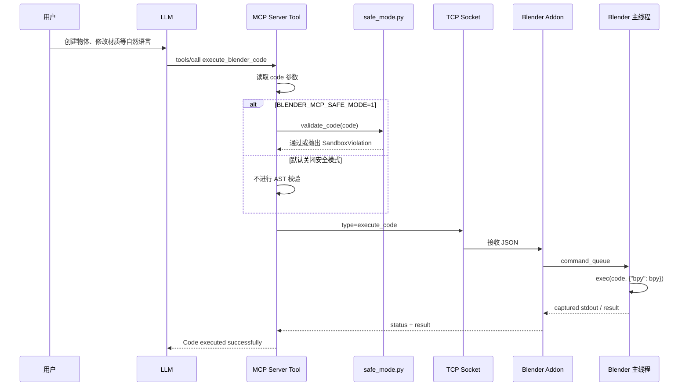

Addon 中的执行逻辑：

```python
namespace = {"bpy": bpy}

capture_buffer = io.StringIO()
with redirect_stdout(capture_buffer):
    exec(code, namespace)

return {
    "executed": True,
    "result": capture_buffer.getvalue()
}
```

安全模式通过以下环境变量启用：

```text
BLENDER_MCP_SAFE_MODE=1
```

它使用 AST 检查代码，默认 deny-by-default，重点阻止 `eval`、`exec`、`open`、进程/文件/网络模块、解释器逃逸路径以及 Blender 持久化执行入口。需要注意，安全模式只保护 MCP Server 路径，不能阻止本机其他进程直接连接 Blender 的 TCP 端口。

---

## 8. 场景观察与视觉验证流程

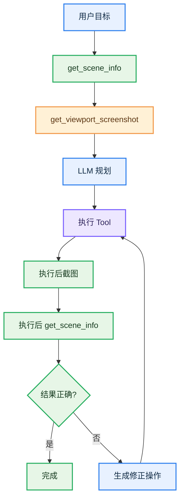

推荐的交互模式是：

```text
先观察 → 规划 → 执行 → 截图验证 → 读取场景 → 必要时修正
```

`get_viewport_screenshot` 会让 Blender 将截图写入临时 PNG，MCP Server 读取图片字节后，以 MCP `Image` 返回给 LLM。

---

## 9. 资源搜索、下载和导入流程

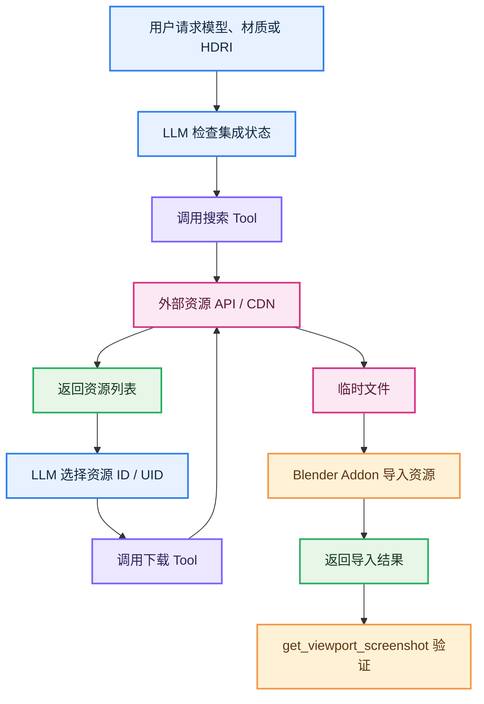

典型顺序：

```text
get_*_status()
→ search_*_models() / search_*_assets()
→ download_*()
→ get_viewport_screenshot()
→ get_scene_info()
```

资源集成是否可用，受 Blender 场景中的开关控制：

```python
bpy.context.scene.blendermcp_use_polyhaven
bpy.context.scene.blendermcp_use_sketchfab
bpy.context.scene.blendermcp_use_polypizza
```

### 9.1 AI 生成模型

Hyper3D Rodin 和 Hunyuan3D 一般采用：

```text
创建任务 → 获取 task_id/job_id → 轮询状态 → 下载生成文件 → 导入 Blender
```

生成任务完成后，策略 Prompt 建议检查导入模型的 `world_bounding_box`，再调整模型的位置、旋转和尺寸。

---

## 10. 响应返回流程

Blender Addon 统一返回：

```json
{
  "status": "success",
  "result": {}
}
```

失败时返回：

```json
{
  "status": "error",
  "message": "错误信息"
}
```

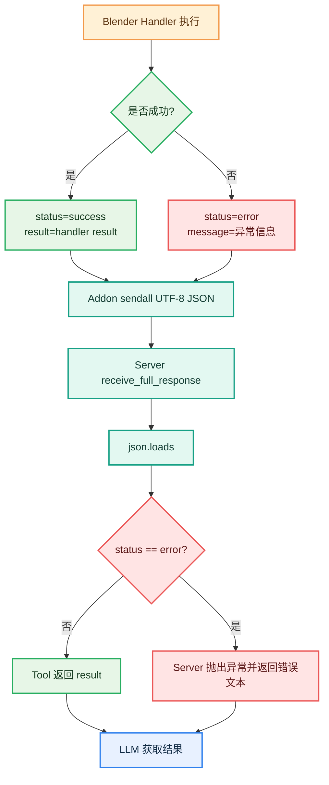

`receive_full_response()` 会反复执行 `recv()`，将多个 TCP 分片拼接起来，直到能够成功解析完整 JSON。TCP 本身没有消息边界，因此不能假设一次 `recv()` 就能得到完整响应。

---

## 11. 错误处理与重连流程

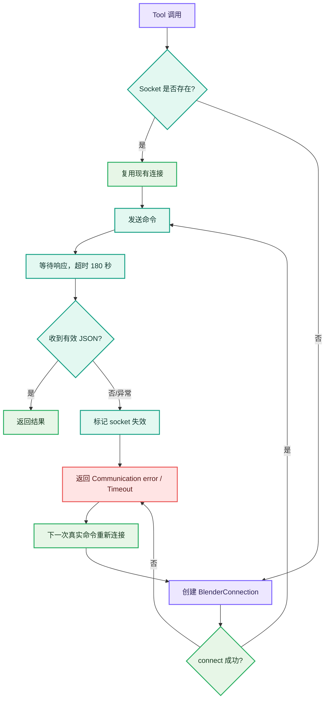

主要异常包括：Addon 没有启动、端口被占用、连接被关闭、命令超时、Socket 被重置、返回数据不完整或 Handler 内部抛出异常。通信错误后，Server 会将当前 Socket 标记失效，由下一次真实命令触发重新连接。

---

## 12. Addon 版本握手和安装流程

### 12.1 Addon 安装流程

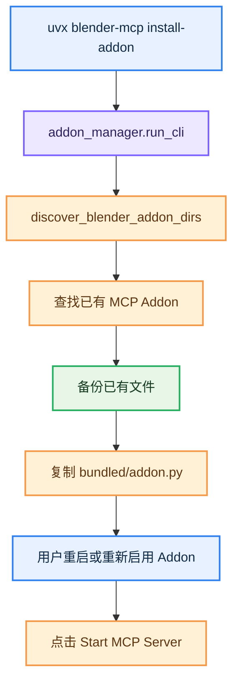

Addon 的打包副本位于：

```text
src/blender_mcp/bundled/addon.py
```

安装工具会将它复制到 Blender 用户 Addon 目录，默认安装文件名为：

```text
blender_mcp.py
```

### 12.2 版本握手

Server 通过 `get_addon_info` 读取 Addon 名称、版本、协议版本、capabilities 和 Blender 版本。Server 与 Addon 都使用协议版本 `5`。如果版本过旧，Server 会提示重新执行 `uvx blender-mcp install-addon`。

---

## 13. Telemetry 和 Trajectory 模块

部分 Tool 使用：

```python
@telemetry_tool("get_scene_info")
```

或：

```python
@trajectory_tool("execute_blender_code", capture_code=True)
```

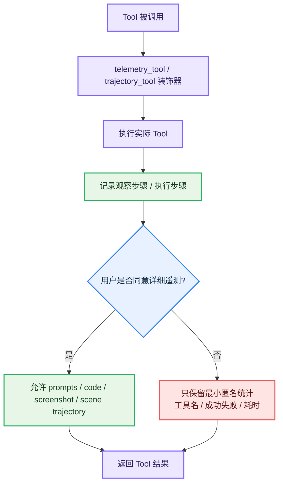

Addon 提供：

```text
get_telemetry_consent
set_telemetry_consent
```

Server 提供：

```text
disable_telemetry
```

详细数据收集受用户同意状态控制；未同意时，项目仍可能保留最小匿名工具使用统计，具体以项目 Telemetry 实现和用户设置为准。

---

## 14. 一次完整请求示例

用户输入：

```text
创建一个红色立方体，放在原点，并确认它出现在视口中。
```

可能的调用顺序：

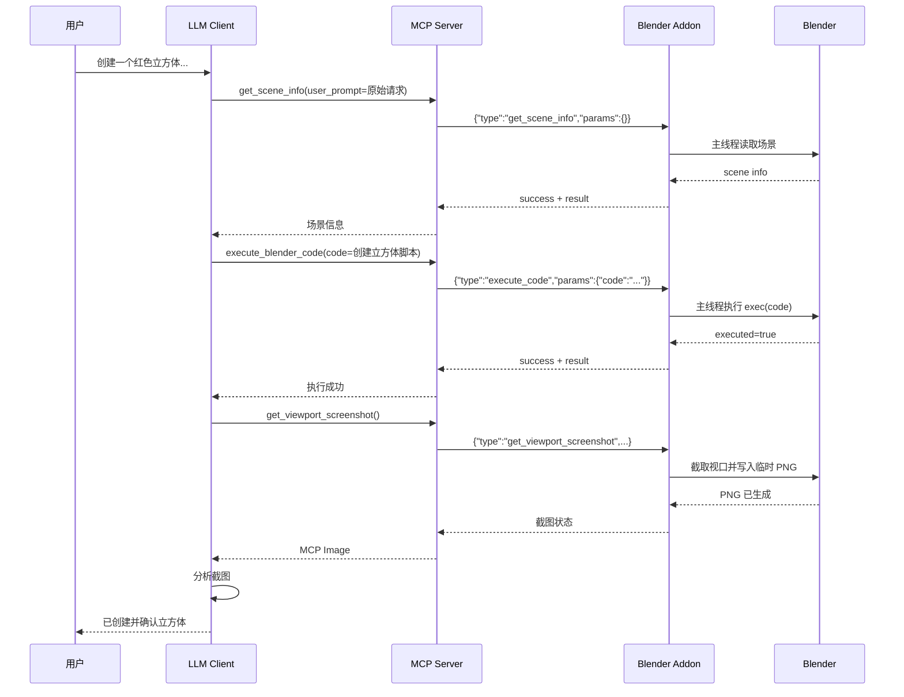

如果截图发现物体不可见，LLM 可以再次调用 `execute_blender_code` 调整相机、对象位置或视口状态。

---

## 15. 核心时序总结

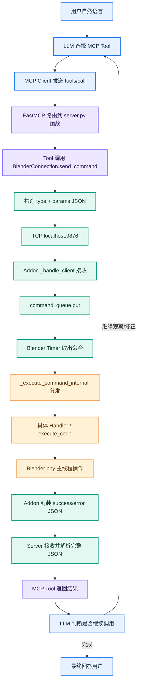

最核心的三层关系：

```text
MCP 协议：LLM Client ↔ MCP Server
TCP + JSON：MCP Server ↔ Blender Addon
Blender Python API：Addon ↔ Blender 场景
```

最核心的线程关系：

```text
Socket 接收线程 → command_queue → Blender 主线程 Timer → bpy
```

最核心的智能关系：

```text
LLM 负责理解用户意图、选择 Tool、生成代码、读取结果和继续修正
MCP Server 负责协议适配、参数转译和连接管理
Blender Addon 负责执行固定命令、访问 bpy 和返回结果
```
