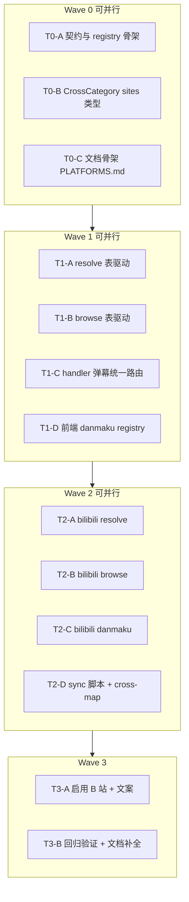

# Live 平台解耦 + Bilibili 接入 — 并行任务清单

> 目标：轻量注册表解耦前后端，Bilibili 作为第一个新 adapter 接入。  
> 原则：**各平台内部逻辑不动，只改注册与分发**；任务按波次并行，波次间有明确依赖。

---

## 依赖总览



| 波次 | 并行度 | 合并前必过 |
|------|--------|------------|
| Wave 0 | 3 任务 | TypeScript 编译通过 |
| Wave 1 | 4 任务 | 三平台 browse/resolve/弹幕行为不变 |
| Wave 2 | 4 任务 | B 站单能力各自可测 |
| Wave 3 | 2 任务 | 全链路 + build |

---

## Wave 0 — 契约与骨架（3 任务并行）

### T0-A 后端 registry 契约 + 三平台注册

**负责人域**：`node-server/src/platforms/`  
**依赖**：无  
**产出文件**：

- 新建 [`node-server/src/platforms/types.ts`](node-server/src/platforms/types.ts) — `ResolveAdapter` / `BrowseAdapter` / `DanmakuAdapter` / `PlatformDef`
- 新建 [`node-server/src/platforms/registry.ts`](node-server/src/platforms/registry.ts) — 注册 douyu / huya / douyin（import 现有模块，不搬逻辑）

**要点**：

```typescript
// PlatformDef 字段
id, resolve, browse?, danmaku?, crossWeight?, roomIdPattern?
```

- 导出 `PLATFORMS`、`getPlatform(id)`、`BROWSE_SITE_IDS`、`CROSS_SITE_WEIGHTS`
- 三平台 `crossWeight`：douyu=2, huya=2, douyin=1（bilibili 占位 weight=1，browse/danmaku/resolve 先 stub 或 omit）
- douyin 的 `fetchGroupRooms` 通过 wrapper 暴露（partition 逻辑仍在 douyin.ts）

**验收**：

- [ ] `npm run build`（node-server）通过
- [ ] registry 可被 `service.ts` / `browse/index.ts` import（尚未改调用方可先只编译）

---

### T0-B CrossCategory `sites` 通用结构

**负责人域**：`node-server/src/browse/`  
**依赖**：无（与 T0-A 无文件冲突）  
**产出文件**：

- 改 [`category-cross-map.ts`](node-server/src/browse/category-cross-map.ts)

**要点**：

```typescript
sites?: Partial<Record<string, { cid: string; pid?: string; groupId?: string }>>;
```

- `gameCidForSite` / `groupCidForSite`：优先 `entry.sites?.[site]`，fallback `entry.douyu` 等旧字段
- `douyinPidForEntry`：可读 `sites.douyin?.pid`
- **不修改** `cross-categories.data.ts` 内容（Wave 2 再 sync）

**验收**：

- [ ] 现有 cross-map API 行为不变（旧字段仍有效）
- [ ] TypeScript 编译通过

---

### T0-C 文档骨架

**负责人域**：`live/` 根目录  
**依赖**：无  
**产出文件**：

- 新建 [`PLATFORMS.md`](PLATFORMS.md)
- 改 [`README.md`](README.md) 加链接

**要点**：

1. Adapter 契约（复制 T0-A 接口说明 + 「加平台 checklist」）
2. 对外 HTTP API 表（`/api/room`、`/api/categories`、`/api/rooms`、`/api/{site}/danmaku`）
3. 斗鱼 / 虎牙 / 抖音 — Browse / Resolve / Danmaku / 图标（从现有代码整理）
4. Bilibili — API 表占位（Wave 2 回填）
5. 链接本文件 `TASK.md`

**验收**：

- [ ] 文档结构完整，API 表与现网 handler 一致

---

## Wave 1 — 表驱动分发（4 任务并行，依赖 Wave 0 合并）

> **合并 Gate**：T0-A + T0-B 必须先合入主分支，Wave 1 再开分支/并行。

### T1-A resolve 改 registry 分发

**依赖**：T0-A  
**冲突域**：[`resolve/service.ts`](node-server/src/resolve/service.ts)、[`parse-room-id.ts`](node-server/src/resolve/parse-room-id.ts)

**改动**：

- 删除四个 `SITE_*` Record，改为 `getPlatform(site).resolve.*`
- `parseRoomId`：从 registry 读 `roomIdPattern`，或保留集中 REGEX 表由 registry 导出
- **不修改** `resolve/douyu|huya|douyin/` 内部

**验收**：

- [ ] `/api/room?site=douyu|huya|douyin` 与改前 payload 一致（抽 1 个房间各测）
- [ ] 离线房间仍返回 `offline: true`

---

### T1-B browse 改 registry 分发

**依赖**：T0-A、T0-B  
**冲突域**：[`browse/index.ts`](node-server/src/browse/index.ts)、[`category-cache-store.ts`](node-server/src/browse/category-cache-store.ts)

**改动**：

- `BROWSE_SITES` → 从 `BROWSE_SITE_IDS` 导入
- `browseApi.fetchCategories/Recommend/CategoryRooms` → 表驱动
- `fetchGroupRoomsForSite` → 优先 `platform.browse.fetchGroupRooms?.(groupId)`，无则保留原 fallback
- `CROSS_SITE_WEIGHTS` → 从 registry 导入
- `category-cache-store` 的 `BROWSE_CATEGORY_SITES` 同步

**验收**：

- [ ] `/api/categories?site=*` 三平台正常
- [ ] `/api/cross-rooms?key=lol` 仍有三平台结果
- [ ] `/api/recommend-related` 正常

---

### T1-C handler 弹幕统一路由

**依赖**：T0-A  
**冲突域**：[`http/handler.ts`](node-server/src/http/handler.ts)、[`danmaku/*.ts`](node-server/src/danmaku/)

**改动**：

- 新增 `GET /api/:site/danmaku?room=` — 查 `platform.danmaku?.fetchSession`
- **保留**旧路径 alias（至少一轮）：
  - `/api/huya/danmaku` → huya
  - `/api/douyin/danmaku` → douyin session
- douyin SSE `/api/douyin/danmaku/stream` 暂保留独立路由（或 registry 增加 `streamDanmaku?` 可选钩子）

**验收**：

- [ ] 虎牙 `/api/huya/danmaku` 与 `/api/huya/danmaku`（新）等价
- [ ] 抖音 session + SSE 流仍可用

---

### T1-D 前端 danmaku registry + 三平台 connector 拆分

**依赖**：无（与后端 Wave 1 可并行开发，联调需 T1-C）  
**冲突域**：[`web/src/composables/useDanmaku.js`](web/src/composables/useDanmaku.js)、新建 `web/src/platforms/`

**产出**：

```
web/src/platforms/
  danmakuRegistry.js
  connectors/
    douyu.js      # 从 useDanmaku 抽出 connectDouyu
    huya.js       # connectHuya
    douyin.js     # connectDouyin (EventSource)
    bilibili.js   # 空 stub，Wave 2 实现
```

**改动**：

- `useDanmaku.connect()` → `getConnector(site)?.connect(ctx)`
- `encodeDouyuMsg` 等搬入对应 connector
- worker 仍按 `site` 分发（Wave 2 加 bilibili 解析）

**验收**：

- [ ] 三平台弹幕连接/重连/断开行为与改前一致
- [ ] 前端 `npm run build` 通过

---

## Wave 2 — Bilibili adapter（4 任务并行，依赖 Wave 1 合并）

### T2-A bilibili resolve

**依赖**：T1-A  
**冲突域**：新建 `resolve/bilibili/`，改 [`registry.ts`](node-server/src/platforms/registry.ts)

**API**：

| 接口 | 用途 |
|------|------|
| `room/v1/Room/get_info` | meta、live_status |
| `xlive/web-room/v2/index/getRoomPlayInfo` | qn 10000/400/250/150/80 |

**文件**：

- `resolve/bilibili/normalize.ts`
- `resolve/bilibili/web-stream.ts`
- `resolve/bilibili/index.ts`

**验收**：

- [ ] `GET /api/room?site=bilibili&room={id}&mode=full` 返回多档 streams
- [ ] 未开播返回 offline payload

---

### T2-B bilibili browse

**依赖**：T1-B  
**冲突域**：新建 `browse/bilibili.ts`，改 registry

**API**：

| 接口 | 用途 |
|------|------|
| `room/v1/Area/getList` | 分类 |
| `room/v1/Area/getRoomList` | 分区房间（cid=area_id, pid=parent_area_id） |
| `xlive/web-interface/v1/second/getList` | 推荐 |

**验收**：

- [ ] `/api/categories?site=bilibili`
- [ ] `/api/rooms?site=bilibili&cid=&pid=`
- [ ] 分类图标来自 API `pic` 字段

---

### T2-C bilibili danmaku

**依赖**：T1-C、T1-D  
**冲突域**：`danmaku/bilibili.ts`、`connectors/bilibili.js`、`workers/danmaku.worker.js`

**后端**：`DanmakuAdapter.fetchSession` → getDanmuInfo  
**前端**：WS auth op=7、heartbeat op=2、worker Brotli + `DANMU_MSG`

**验收**：

- [ ] `/api/bilibili/danmaku?room=` 返回 host/port/token
- [ ] 播放页 B 站房间弹幕滚动

---

### T2-D sync 脚本 + cross-map 数据

**依赖**：T0-B、T2-B  
**冲突域**：[`scripts/sync-category-cross-map.mjs`](node-server/scripts/sync-category-cross-map.mjs)、[`cross-categories.data.ts`](node-server/src/browse/cross-categories.data.ts)

**改动**：

- 引入 `fetchBilibiliCategories()`
- 名称匹配写入 `sites.bilibili = { cid, pid }`（与旧字段 douyu/huya/douyin 双写）
- group 大类 bilibili parent：网游 2 / 手游 3 / 单机 6 / 娱乐 1
- 运行 `npm run sync:cross-map`  regenerate data

**验收**：

- [ ] 热门条目（lol/wzry 等）含 `sites.bilibili`
- [ ] `/api/cross-rooms?key=lol` 含 bilibili 房间

---

## Wave 3 — 集成与收尾（2 任务）

### T3-A 启用 B 站 + 文案

**依赖**：T2-A/B/C/D 全部  
**冲突域**：[`web/src/config/platforms.js`](web/src/config/platforms.js)、registry bilibili 条目补全

**改动**：

- `bilibili.enabled: true`, `browse: true`, 实测 `defaultRoom`
- registry 注册 bilibili resolve + browse + danmaku，`crossWeight: 1`
- 全平台描述文案更新（权重 2:2:1:1）
- `PLATFORMS.md` B 站章节回填

**验收**：

- [ ] 导航/分类/播放/弹幕全流程可用

---

### T3-B 回归验证 + build

**依赖**：T3-A  
**无代码冲突**（除非修 bug）

**检查清单**：

- [ ] douyu / huya / douyin 解析 + 浏览 + 弹幕回归
- [ ] bilibili 解析 + 浏览 + 弹幕
- [ ] cross-rooms / recommend-related
- [ ] `node-server` + `web` build 通过
- [ ] `PLATFORMS.md` 与实现一致

---

## 并行执行建议

| 场景 | 推荐并行组合 |
|------|-------------|
| 2 人 | A: T0-A→T1-A→T2-A / B: T0-B→T1-B→T2-B→T2-D |
| 3 人 | A: resolve 链 / B: browse+cross 链 / C: T0-C→T1-D→T2-C |
| 4 Agent | Wave 1 四任务同时开（T1-A/B/C/D） |

**避免同文件并行**：`registry.ts` 在 Wave 2 由一人串行追加 bilibili 注册，或约定「每 adapter 任务只 export adapter 对象，registry 合并 commit 单独做」。

---

## 加平台 Checklist（解耦后）

1. 实现 `resolve/{id}/`（可选 `browse/{id}.ts`、`danmaku/{id}.ts`）
2. 在 [`registry.ts`](node-server/src/platforms/registry.ts) 注册 `PlatformDef`
3. 前端 `connectors/{id}.js` + 注册到 `danmakuRegistry.js`（若需弹幕）
4. [`platforms.js`](web/src/config/platforms.js) 启用 UI
5. sync 脚本增加分类源 + `sites.{id}` 映射
6. 更新 [`PLATFORMS.md`](PLATFORMS.md)

---

## 相关文档

- 架构说明：见 Cursor plan「平台文档与 B 站接入」
- 斗鱼解析细节参考：[`server/streamget-douyu.md`](server/streamget-douyu.md)
