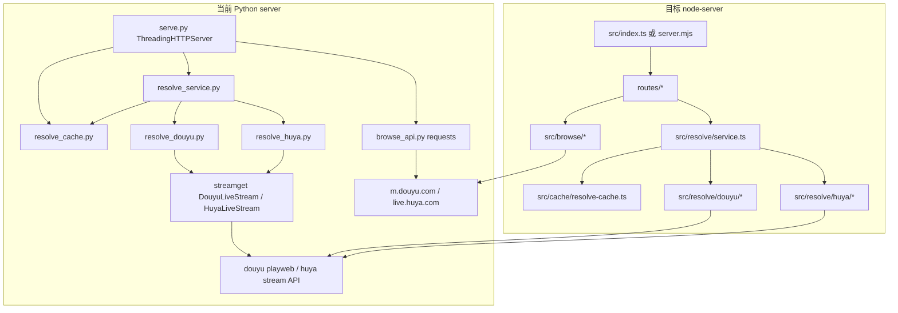
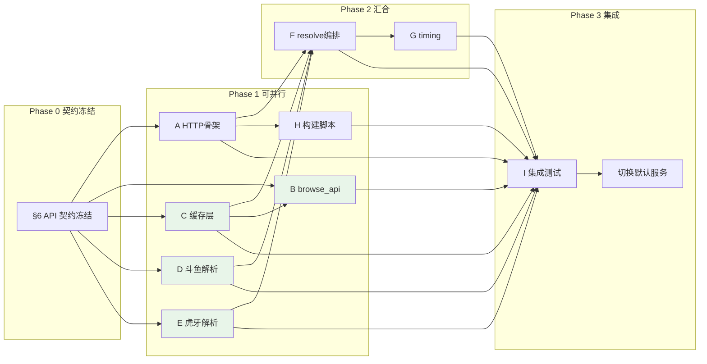

# live/node-server 迁移规划（方案 B：全 Node 重写）

> **状态**：规划文档（未实现）  
> **目标**：用 `live/node-server` 替换 `live/server` 的 Python + streamget 服务，**前端 `live/web` 零改动**。  
> **原则**：接口契约先行冻结，泳道解耦，仅集成阶段汇合。

---

## 1. 背景与目标

### 1.1 为何迁移到 Node

| 现状痛点 | Node 方案收益 |
|----------|---------------|
| Python 依赖 `streamget`（含 Node 子进程 `streamget install-node`），运行时栈分裂 | 解析逻辑与 HTTP 服务统一为 Node，去掉 Python venv + streamget |
| PyInstaller 打包 `live-api.exe` 体积大、冷启动慢、hiddenimports 维护成本高 | 复用仓库已有 `node.exe` 分发模式（`dist/web` 已采用），或 `pkg` 单文件 |
| `serve.py` 基于 `ThreadingHTTPServer`，异步解析靠额外线程事件循环桥接 | 原生 `async/await`，斗鱼多档 `getH5PlayV1` 并发更自然 |
| 开发与 CI 需 Python 3 + pip | 与 `live/web` 共用 Node 20 工具链 |

### 1.2 保留什么（不可破坏的契约）

1. **HTTP 路径与动词**：`GET/POST/OPTIONS` 下所有 `/api/*` 端点路径不变（见 §6）。
2. **JSON 响应形状**：字段名、嵌套结构、`ok` 语义、HTTP 状态码与 Python 版一致。
3. **配置语义**：`config.json` / `config.local.json` 深合并规则、`host`/`port`/`cors`/`static` 行为与 [`app_config.py`](../server/app_config.py) 对齐。
4. **前端调用方式**：[`live/web/src/api/*.js`](../web/src/api/) 不修改；`source=local` 等冗余 query 继续忽略即可。
5. **发布目录约定**：`dist/server/` 仍为 API 包，`dist/web/` 仍为前端包；`dist/start.bat` 启动流程不变（仅可执行文件名可能从 `live-api.exe` 变为 `node.exe` + 入口脚本）。

### 1.3 明确不迁移（本阶段）

- `live/server/huya_danmaku.py`、弹幕相关（若前端未调用 API，可后续单独立项）。
- `muxia_api.py`、`compare_streams.py` 的运行时依赖（保留为 **对比基准工具**，不打包进生产）。
- Python `resolve_*.py` CLI 的 `--compare` 模式（集成泳道 I 用脚本替代）。

---

## 2. 架构对比



| 维度 | Python `live/server` | Node `live/node-server` |
|------|----------------------|-------------------------|
| HTTP 框架 | `http.server` 手写路由 | 推荐 **Fastify** 或 **原生 `node:http`**（保持轻量、无多余抽象） |
| 出站 HTTP | `requests` / streamget 内部 | `fetch`（Node 18+）或 `undici` |
| 解析实现 | streamget 封装 | **纯 Node 重写** HTTP 步骤（斗鱼见 [`streamget-douyu.md`](../server/streamget-douyu.md)） |
| 缓存 | 进程内 `OrderedDict` + `threading.Lock` | 进程内 `Map` + 互斥或单线程事件循环（同 TTL/LRU 语义） |
| 配置根目录 | PyInstaller 下为 exe 同目录 | `pkg` 或 `node.exe` 同目录；开发时为 `node-server/` |
| 静态托管 | `Handler._serve_web` SPA fallback | 同等逻辑：`static.enabled` + `distPath` + `index.html` 回退 |
| 打包产物 | `dist/server/live-api.exe` | `dist/server/node.exe` + `live-api.mjs`（或 `pkg` 生成 `live-api.exe`） |

---

## 3. 目录结构建议

```
live/node-server/
├── MIGRATION.md              # 本文档
├── package.json
├── tsconfig.json             # 若用 TypeScript（推荐，便于契约类型化）
├── config.json               # 从 server/config.json 复制并同步维护
├── config.example.json
├── src/
│   ├── index.ts              # 入口：读配置、监听、挂载路由
│   ├── config/
│   │   └── load-config.ts    # 对应 app_config.py
│   ├── middleware/
│   │   ├── cors.ts           # 对应 serve.py _cors
│   │   └── sanitize-json.ts  # 对应 text_sanitize.py
│   ├── static/
│   │   └── serve-static.ts   # 对应 serve.py _serve_web
│   ├── routes/
│   │   ├── health.ts         # GET /api/health
│   │   ├── room.ts           # GET /api/room
│   │   ├── resolve.ts        # POST /api/resolve
│   │   ├── categories.ts     # GET /api/categories
│   │   ├── rooms.ts          # GET /api/rooms
│   │   └── time.ts           # GET /api/time
│   ├── cache/
│   │   └── resolve-cache.ts  # 对应 resolve_cache.py
│   ├── browse/
│   │   ├── index.ts          # fetch_categories / fetch_*_rooms 分发
│   │   ├── douyu.ts          # 斗鱼分类与列表
│   │   └── huya.ts           # 虎牙分类与列表
│   ├── resolve/
│   │   ├── service.ts        # 对应 resolve_service.py
│   │   ├── schema.ts         # 对应 room_schema.py
│   │   ├── timing.ts         # 对应 resolve_timing.py
│   │   ├── parse-room-id.ts  # 对应 serve.py parse_room_id
│   │   ├── douyu/
│   │   │   ├── normalize.ts
│   │   │   ├── betard.ts     # Step 1
│   │   │   ├── encryption.ts # Step 2 getEncryption + auth
│   │   │   ├── play-v1.ts    # Step 3 getH5PlayV1
│   │   │   └── index.ts      # loadMeta / resolveTier / resolveAllTiers
│   │   └── huya/
│   │       ├── normalize.ts
│   │       ├── anti-code.ts  # _build_anti_code
│   │       ├── web-stream.ts
│   │       └── index.ts
│   └── utils/
│       └── format-online.ts  # browse 在线人数格式化
├── scripts/
│   ├── compare-with-python.mjs   # 泳道 I：与 Python 输出 diff
│   └── benchmark-resolve.mjs     # 对应 benchmark_resolve.py
├── tests/
│   ├── contract/                   # 各端点 JSON schema 快照
│   ├── cache.test.ts
│   ├── douyu.test.ts
│   └── huya.test.ts
└── start.ps1                   # 开发启动（替代 server/start.ps1）
```

**与旧目录关系**：迁移完成前 `live/server/` 只读保留；`node-server` 的 `npm run build` 输出到 `dist/server/`。

---

## 4. 并行工作流（泳道）

> 泳道在 **§6 API 契约** 与 **§4 各泳道「输出接口」** 确认后即可并行；**泳道 A** 仅需先交付路由挂载点与 mock 响应，不要求真实解析。

### 泳道 A：HTTP 骨架 + config + CORS + health

| 项 | 内容 |
|----|------|
| **ID** | `A` |
| **可并行原因** | 仅依赖已冻结的 HTTP 契约；health 中 `resolve_cache` 可先返回静态占位，后续由 C 注入 |
| **复杂度** | **M**（2–3 人日） |

**任务清单**

- [ ] 初始化 `live/node-server/package.json`（`"type": "module"`，Node `>=20.18.1`）
- [ ] 实现 `src/config/load-config.ts`：`DEFAULT_CONFIG`、深合并、`config.local.json`、frozen 模式下 exe 同目录解析（对齐 [`app_config.py`](../server/app_config.py)）
- [ ] 实现 `src/middleware/cors.ts`：`OPTIONS → 204`，头含 `Access-Control-Allow-Private-Network: true`
- [ ] 实现 `src/middleware/sanitize-json.ts`：孤立 surrogate 清理（对齐 [`text_sanitize.py`](../server/text_sanitize.py)）
- [ ] 实现 `src/static/serve-static.ts`：`static.enabled`、`distPath`、路径穿越校验、SPA `index.html` fallback、`Permissions-Policy: unload=(self)`、`X-Live-Web-Root`
- [ ] 实现 `src/routes/health.ts`：`GET /api/health` 完整字段（`resolve_cache` 调用 `cache.stats()`，C 未完成时临时 `{ entries: 0, ... }`）
- [ ] 实现 `src/index.ts`：CLI `--config` / `--port`，绑定失败时打印与 `serve.py` 等价的端口占用提示
- [ ] 复制 `config.json` → `live/node-server/config.json`
- [ ] 添加 `start.ps1` 开发启动脚本

**输出接口（供其他泳道）**

```ts
// 挂载约定（示例）
export type AppContext = {
  config: ServerConfig;
  cache: ResolveCache;      // 泳道 C 实现
  resolveService: ResolveService; // 泳道 F 实现
  browseApi: BrowseApi;     // 泳道 B 实现
};
// registerRoutes(app, ctx) — 各泳道注册自己的 router
```

**验收标准**

- `curl http://127.0.0.1:8765/api/health` 返回 JSON 且含 `ok`、`mode`、`browse_api: true`
- `OPTIONS /api/room` 返回 204 且 CORS 头完整
- `static.enabled=true` 且存在 `dist/web/index.html` 时能托管静态页；否则非 `/api/*` 返回 api-only 404 JSON

---

### 泳道 B：browse_api（categories / rooms）

| 项 | 内容 |
|----|------|
| **ID** | `B` |
| **可并行原因** | 不依赖解析；仅依赖泳道 A 的路由注册约定 + 泳道 C 的通用 `cache.get/set`（可用内存 mock） |
| **复杂度** | **M**（2–3 人日） |

**任务清单**

- [ ] `src/browse/douyu.ts`：`GET m.douyu.com/api/cate/list`、`GET m.douyu.com/api/room/list`（对齐 [`browse_api.py`](../server/browse_api.py) `_fetch_douyu_*`）
- [ ] `src/browse/huya.ts`：静态 `_HUYA_CATEGORY_GROUPS`、`GET live.huya.com/liveHttpUI/getLiveList`（对齐 `_fetch_huya_*`）
- [ ] `src/browse/index.ts`：`fetchCategories`、`fetchRecommendRooms`、`fetchCategoryRooms` 分发
- [ ] `src/utils/format-online.ts`：`_format_online` 逻辑
- [ ] 房间归一化：`roomId/siteId/status/title/nickname/cid/category/online/cover` 字段与 Python 一致
- [ ] `src/routes/categories.ts`：缓存键 `browse:categories:{site}`，TTL **300s**
- [ ] `src/routes/rooms.ts`：缓存键 `browse:rooms:{site}:...`，TTL **60s**；缺 `cid` 且非 recommend 时 **400**

**输入接口**

- `ResolveCache.get(key)` / `set(key, data, { ttl })`（泳道 C）
- `sanitizeUnicode(obj)`（泳道 A）

**输出接口**

```ts
export interface BrowseApi {
  fetchCategories(site: string): Promise<CategoryGroup[]>;
  fetchRecommendRooms(site: string, page: number): Promise<RoomsPayload>;
  fetchCategoryRooms(site: string, cid: string, page: number, pid?: string): Promise<RoomsPayload>;
}
```

**验收标准**

- `GET /api/categories?site=douyu` 与 Python 响应结构一致（允许分类顺序差异，字段必须一致）
- `GET /api/rooms?site=huya&recommend=1&page=1` 返回 `list/hasMore/page`
- 连续请求第二次带 `"cached": true`（在 TTL 内）

---

### 泳道 C：缓存层 resolve_cache

| 项 | 内容 |
|----|------|
| **ID** | `C` |
| **可并行原因** | 纯内存模块，无外部 IO；接口即 [`resolve_cache.py`](../server/resolve_cache.py) 的 TypeScript 翻译 |
| **复杂度** | **S**（1 人日） |

**任务清单**

- [ ] `src/cache/resolve-cache.ts`：实现 `get/set/stats`
- [ ] 分层 API：`getMeta/setMeta`、`getTier/setTier`、`getPayload/setPayload`
- [ ] 常量：`PAYLOAD_TTL=20`、`TIER_TTL=20`、`META_TTL=180`、`MAX_ENTRIES=100`
- [ ] LRU：`get` 时 move-to-end；超容 evict 最旧
- [ ] 过期清理：`get` 时惰性 purge
- [ ] 深拷贝：存入/取出时 clone（对齐 `copy.deepcopy`）
- [ ] 单元测试 `tests/cache.test.ts`：TTL、LRU、分层 key 格式

**输出接口**

```ts
export interface ResolveCache {
  get(key: string): unknown | null;
  set(key: string, data: unknown, opts?: { ttl?: number }): void;
  stats(): { entries: number; max_entries: number; ttl_sec: { meta: number; tier: number; payload: number } };
  getMeta(site: string, roomId: string): Meta | null;
  setMeta(site: string, roomId: string, meta: Meta): void;
  // ... tier / payload 同理
}
```

**验收标准**

- `stats()` 形状与 `GET /api/health` 中 `resolve_cache` 一致
- 行为与 Python 单测/手动测试一致：20s 内重复 payload 命中、`force=true` 绕过

---

### 泳道 D：斗鱼解析 resolve_douyu

| 项 | 内容 |
|----|------|
| **ID** | `D` |
| **可并行原因** | 与虎牙、HTTP 路由独立；仅需遵守 meta/tier 契约，供 F 编排 |
| **复杂度** | **L**（4–6 人日） |

**任务清单**

- [ ] `src/resolve/douyu/normalize.ts`：`normalizeUrl`（对齐 [`resolve_douyu.py`](../server/resolve_douyu.py) L19–27）
- [ ] `src/resolve/douyu/betard.ts`：`GET /betard/{rid}`，校验 `show_status == 1`（见 [`streamget-douyu.md`](../server/streamget-douyu.md) §3）
- [ ] `src/resolve/douyu/encryption.ts`：`getEncryption` + `auth` 计算（§4，与 streamget 算法一致）
- [ ] `src/resolve/douyu/play-v1.ts`：`POST getH5PlayV1`，参数 `rate/cdn=hw-h5/ver/did/enc_data/auth/tt`
- [ ] `src/resolve/douyu/index.ts`：`loadMeta`、`resolveTier`、`resolveAllTiers`
- [ ] 白名单单次复用：同一次 meta 内避免重复 `getEncryption`（对齐 `_cache_white_key`）
- [ ] `isDouyucdnUrl`：过滤 `edgesrv.com`，只保留 `douyucdn`（§6.3）
- [ ] `meta.context` 序列化字段：`rid/url/anchor_name/multirates/cdns/line_label/preferred_cdn/white/base`
- [ ] 多档并发：`resolveAllTiers` 对 `multirates` 并行请求，`seen_paths` 去重
- [ ] 封面 `_cover_from_room` 逻辑

**输入接口**

- 无（直连斗鱼公网 API）

**输出接口**

```ts
export const douyuAdapter = {
  normalizeUrl(room: string): string;
  loadMeta(url: string): Promise<DouyuMeta>;
  resolveTier(meta: DouyuMeta, qualityName?: string): Promise<Tier>;
  resolveAllTiers(meta: DouyuMeta): Promise<Tier[]>;
};
```

**验收标准**

- 房间 `5720533`（或文档示例）懒加载单档：`play_url` 含 `douyucdn` 且不含 `edgesrv`
- 全档：各档 FLV **文件名**（query 前 basename）与 Python `resolve_douyu.py 5720533` 一致
- 未开播房间抛出可映射为「房间未开播」的错误

---

### 泳道 E：虎牙解析 resolve_huya

| 项 | 内容 |
|----|------|
| **ID** | `E` |
| **可并行原因** | 与斗鱼完全独立 |
| **复杂度** | **L**（4–5 人日） |

**任务清单**

- [ ] `src/resolve/huya/normalize.ts`
- [ ] `src/resolve/huya/anti-code.ts`：移植 `_build_anti_code`（MD5、wsTime、uuid 等，对齐 [`resolve_huya.py`](../server/resolve_huya.py) L43–64）
- [ ] `src/resolve/huya/web-stream.ts`：拉取 web stream data（等效 `HuyaLiveStream.fetch_web_stream_data`）
- [ ] App fallback：`fetch_app_stream_data` 路径，生成单档 `app_fallback_tier`
- [ ] `loadMeta` / `resolveTier` / `resolveAllTiers`：多线路 `gameStreamInfoList` → `lines[].url`
- [ ] `_quality_items`：从 `vMultiStreamInfo` 构建 `available_qualities`
- [ ] URL 强制 `https://`

**输出接口**

```ts
export const huyaAdapter = { /* 同 D 的 adapter 形状 */ };
```

**验收标准**

- 房间 `579236`（默认测试房）懒加载与 Python `resolve_huya.py` 输出档位名一致
- 每条 `lines[].url` 可播放（HTTPS FLV，含刷新后的 `wsSecret`）
- 未开播时行为与 Python 一致（抛错或 app fallback）

---

### 泳道 F：resolve_service 编排 + room_schema

| 项 | 内容 |
|----|------|
| **ID** | `F` |
| **可并行原因** | 可用 **mock adapter** 开发编排；D/E 就绪后替换注册表即可 |
| **复杂度** | **M**（2–3 人日） |

**任务清单**

- [ ] `src/resolve/schema.ts`：`pickQualityName`、`buildRoomPayload`（对齐 [`room_schema.py`](../server/room_schema.py)）
- [ ] `src/resolve/parse-room-id.ts`：对齐 `serve.py` `ROOM_RES` 正则
- [ ] `src/resolve/service.ts`：`resolveRoom({ site, roomId, mode, quality, force })`
  - [ ] payload / meta / tier 三层缓存读写（泳道 C）
  - [ ] `mode=lazy`：单档 + `partial: true`、`quality` 字段
  - [ ] `mode=full`：全档 `streams`
  - [ ] `_timing`：`total_ms/meta_ms/tier_ms/*_cached`（对齐 [`resolve_service.py`](../server/resolve_service.py)）
  - [ ] `source: "streamget"` 保留（前端不依赖，但避免 diff 噪声）
- [ ] `src/routes/room.ts`：`GET /api/room`；未开播 **404** `{"ok":false,"error":"房间未开播"}`（对齐 `serve.py` L175–177）
- [ ] `src/routes/resolve.ts`：`POST /api/resolve`；body/query 双来源；无效 JSON **400**

**输入接口**

- 泳道 C `ResolveCache`
- 泳道 D/E `douyuAdapter` / `huyaAdapter`

**输出接口**

```ts
export interface ResolveService {
  resolveRoom(opts: ResolveOptions): Promise<RoomPayload>;
}
```

**验收标准**

- `GET /api/room?site=douyu&room=5720533&mode=lazy` 与 Python 同房间 JSON 关键字段一致（见 §6.3）
- `force=1` 绕过缓存；`quality=` 命中 `pickQualityName` 规则（含「高清/超清/蓝光」优先）

---

### 泳道 G：resolve_timing + /api/time

| 项 | 内容 |
|----|------|
| **ID** | `G` |
| **可并行原因** | 依赖 F 的 `resolveRoom` 接口，可在 F mock 完成后立即并行 |
| **复杂度** | **S**（0.5–1 人日） |

**任务清单**

- [ ] `src/resolve/timing.ts`：`buildTimeReport`（对齐 [`resolve_timing.py`](../server/resolve_timing.py)）
- [ ] `src/routes/time.ts`：`GET /api/time`；`run=0` 仅返回 `cache`+`params`；`run=1` 执行 cold/warm 两次 benchmark
- [ ] cold：`force=true`；warm：`force=false`

**验收标准**

- `GET /api/time?site=douyu&room=252140` 返回 `ok/server_time/cache/params`
- `run=1` 时 `benchmark.runs` 含 `cold` 与 `warm` 标签及 `wall_ms/timing/cached_*`

---

### 泳道 H：构建脚本 build-dist 改造

| 项 | 内容 |
|----|------|
| **ID** | `H` |
| **可并行原因** | 仅需 A 的入口文件路径约定；可与 D/E 解析开发并行 |
| **复杂度** | **M**（2 人日） |

**任务清单**

- [ ] `node-server`：`npm run build` 直接产出 `dist/server/live-api.mjs`
- [ ] 产出布局（推荐方案）：
  ```
  dist/server/
    node.exe          # 复用 build 缓存的 Node 20.18.1
    live-api.mjs      # 捆绑后的 ESM 入口（或 index.mjs）
    config.json
    start.bat
  ```
- [ ] 更新 `dist/server/start.bat`：`node.exe live-api.mjs`（读 `config.json` port）
- [ ] 更新 `dist/start.bat`：检测 `node.exe` + 入口文件，不再要求 `live-api.exe`
- [ ] `npm run build`：可选 `esbuild` 单文件打包依赖，或 `tsc` 输出 `dist/`
- [ ] 可选：`pkg` / `nexe` 生成同名 `live-api.exe` 以降低用户感知差异
- [ ] 更新 [`live/README.md`](../README.md)、[`live/server/README.md`](../server/README.md) 指向 `node-server`
- [ ] 移除对 `live/server/.venv` 的构建时硬依赖

**验收标准**

- 干净环境分别在 `live/web`、`live/node-server` 执行 `npm run build` 成功，无需 Python
- `dist/start.bat` 启动后 `GET /api/health` 正常
- 包体积与启动耗时可记录（对比旧 `live-api.exe`）

---

### 泳道 I：集成测试 + Python 对比基准

| 项 | 内容 |
|----|------|
| **ID** | `I` |
| **可并行原因** | 测试用例、快照、脚本骨架可提前写；**全绿需等待 A–H 汇合** |
| **复杂度** | **M**（2–3 人日） |

**任务清单**

- [ ] `scripts/compare-with-python.mjs`：同参数请求 Python `8765` 与 Node `8766`，diff 关键字段
- [ ] 覆盖端点：`/api/health`、`/api/room`（douyu/huya lazy+full）、`/api/categories`、`/api/rooms`、`/api/time?run=1`
- [ ] 对接 [`live/web/scripts/check-pages.mjs`](../web/scripts/check-pages.mjs) 端点列表
- [ ] 斗鱼 FLV basename 对比逻辑（移植 [`compare_streams.py`](../server/compare_streams.py) 思路）
- [ ] 性能基准：对齐 `benchmark_resolve.py` / `web/scripts/benchmark-play.mjs` 指标
- [ ] CI 本地脚本：`npm test` 跑契约快照 + 缓存单测
- [ ] 文档化「对比失败容忍」：仅 `wsAuth/token` 查询参数允许不同

**验收标准**

- 所有契约测试通过；与 Python 对比 **结构 100% 一致**，斗鱼 **FLV basename 100% 一致**
- 前端 `npm run dev` 指向 Node API，播放页无回归

---

## 5. 依赖关系图



**并行阶段说明**

| 阶段 | 可并行泳道 | 汇合点 |
|------|------------|--------|
| Phase 0 | 全员阅读 §6、§7 | 契约 PR 合并 |
| Phase 1 | **A、B、C、D、E、H** 六路同时开工 | A 提供 `registerRoutes`；C 提供 cache 接口 |
| Phase 2 | **F、G**（F 可用 mock D/E） | 路由层 `/api/room` `/api/resolve` `/api/time` 可用 |
| Phase 3 | **I** + 文档 + 切换构建默认 | `build-dist.bat` 默认产出 Node 包 |

---

## 6. API 契约冻结表

> 以下为实现 **必须** 遵守的契约；字段多传（如 `source=local`）可忽略，**不可少传、不可改名**。

### 6.1 通用

| 项 | 约定 |
|----|------|
| Content-Type | 响应 `application/json; charset=utf-8` |
| JSON 编码 | UTF-8，`sanitize_unicode` 后输出；`ensure_ascii=false` 等价 |
| CORS | `Access-Control-Allow-Origin`（默认 `*`）、`Methods: GET, POST, OPTIONS`、`Headers: Content-Type`、`Allow-Private-Network: true` |
| 错误体 | `{"ok": false, "error": "<message>"}` |

### 6.2 `GET /api/health`

| 请求 | 无 query |
|------|----------|
| 状态码 | 200 |

**响应体**

```json
{
  "ok": true,
  "mode": "api-only",
  "host": "127.0.0.1",
  "port": 8765,
  "static_enabled": false,
  "static_root": null,
  "browse_api": true,
  "resolve_cache": {
    "entries": 0,
    "max_entries": 100,
    "ttl_sec": { "meta": 180, "tier": 20, "payload": 20 }
  }
}
```

`mode`：`static_root` 非空时为 `"static+api"`，否则 `"api-only"`。

### 6.3 `GET /api/room`

| Query | 默认 | 说明 |
|-------|------|------|
| `site` | `douyu` | `douyu` \| `huya` |
| `room` / `id` | `9999` | 房间号或 URL |
| `mode` | `lazy` | `lazy` \| `full` |
| `quality` | — | 档位名模糊匹配 |
| `force` | `0` | `1/true/yes` 跳过缓存 |

| 场景 | 状态码 | 响应 |
|------|--------|------|
| 成功 | 200 | 房间 payload + `"ok": true`（`finalize_payload`） |
| 未开播 | 404 | `{"ok": false, "error": "房间未开播"}` |
| 异常 | 500 | `{"ok": false, "error": "..."}` |

**成功响应核心字段**（[`room_schema.py`](../server/room_schema.py)）

```json
{
  "ok": true,
  "source_url": "https://www.douyu.com/5720533",
  "source": "streamget",
  "fetched_at": "2026-06-13T12:00:00+08:00",
  "platform": "douyu",
  "site": "douyu",
  "room_id": "5720533",
  "anchor_name": "",
  "title": "",
  "cover": "",
  "is_live": true,
  "status": true,
  "streams": [{ "name": "高清", "lines": [{ "name": "线路7", "url": "https://..." }] }],
  "available_qualities": [{ "name": "高清", "rate": 2 }],
  "play_url": "https://...",
  "flv_url": "https://...",
  "m3u8_url": "",
  "backup_urls": [],
  "meta": { "site": "douyu", "room_id": "5720533", "title": "", "anchor_name": "", "cover": "", "is_live": true, "available_qualities": [] },
  "partial": true,
  "quality": "高清",
  "_timing": { "total_ms": 0, "meta_ms": 0, "tier_ms": 0, "payload_cached": false, "meta_cached": false, "tier_cached": false }
}
```

`mode=full` 时无 `partial`/`quality`（或可不返回）；`streams` 含多档。

### 6.4 `POST /api/resolve`

| Body JSON | Query 备选 | 说明 |
|-----------|------------|------|
| `room` | `room` | |
| `site` | `site` | |
| `mode` | `mode` | |
| `quality` | `quality` | |
| `force` | `force` | |

| 场景 | 状态码 |
|------|--------|
| 成功 | 200，同 `/api/room` 成功体 |
| 无效 JSON | 400 `{"ok": false, "error": "无效 JSON"}` |
| 异常 | 500 |

> 与 `/api/room` 差异：POST **不** 对未开播单独 404（Python 当前实现直接 500/返回错误）；迁移时 **保持 Python 行为**，以 `serve.py` `_api_resolve_post` 为准。

### 6.5 `GET /api/categories`

| Query | 默认 |
|-------|------|
| `site` | `douyu` |

**200 响应**

```json
{
  "ok": true,
  "site": "douyu",
  "categories": [
    { "id": "1", "name": "游戏", "list": [{ "cid": 1, "name": "英雄联盟", "pic": "..." }] }
  ],
  "cached": true
}
```

虎牙 `categories` 为静态分组（见 `browse_api.py` `_HUYA_CATEGORY_GROUPS`）。

### 6.6 `GET /api/rooms`

| Query | 默认 | 说明 |
|-------|------|------|
| `site` | `douyu` | |
| `page` | `1` | |
| `cid` / `id` | — | 分类房间必填（除非 recommend） |
| `pid` | — | 兼容参数，可忽略 |
| `recommend` | — | `1/true/yes` 时为推荐流 |

**200 响应**

```json
{
  "ok": true,
  "site": "douyu",
  "list": [
    {
      "roomId": "123",
      "siteId": "douyu",
      "status": true,
      "title": "",
      "nickname": "",
      "cid": "1",
      "category": "",
      "online": "1.2万",
      "cover": ""
    }
  ],
  "hasMore": true,
  "page": 1,
  "cid": "1",
  "cached": false
}
```

缺 `cid` 且非 recommend：**400** `{"ok": false, "error": "缺少 cid 参数"}`。

### 6.7 `GET /api/time`

| Query | 默认 |
|-------|------|
| `site` | `douyu` |
| `room` / `id` | `252140` |
| `quality` | — |
| `run` | `0` |

**200 响应（run=0）**

```json
{
  "ok": true,
  "server_time": "2026-06-13T04:00:00.000000+00:00",
  "cache": { "entries": 0, "max_entries": 100, "ttl_sec": { "meta": 180, "tier": 20, "payload": 20 } },
  "params": { "site": "douyu", "room": "252140", "quality": "", "run": false }
}
```

**run=1 时追加**

```json
{
  "benchmark": {
    "site": "douyu",
    "room": "252140",
    "quality": "",
    "runs": [
      { "label": "cold", "desc": "force=1 跳过缓存", "wall_ms": 0, "timing": {}, "cached": false, "cached_meta": false, "cached_tier": false, "payload_cached": false, "anchor": "", "is_live": true },
      { "label": "warm", "desc": "命中 payload 缓存", "wall_ms": 0, "timing": {}, "cached": true, "cached_meta": false, "cached_tier": false, "payload_cached": true, "anchor": "", "is_live": true }
    ]
  }
}
```

### 6.8 非 API 静态路由

| 条件 | 行为 |
|------|------|
| `static.enabled=false` | 非 `/api/*` → 404 JSON（api-only 提示） |
| `static.enabled=true` | 托管 `distPath`；目录请求 → `index.html`；未知路径 SPA fallback |

---

## 7. 解析迁移专项（斗鱼 / 虎牙）

### 7.1 斗鱼：从 streamget 到纯 Node

**权威步骤文档**：[`live/server/streamget-douyu.md`](../server/streamget-douyu.md)

**迁移要点（泳道 D 必读本节）**

| 步骤 | API | Node 实现位置 |
|------|-----|---------------|
| ① 房间号 | `GET https://www.douyu.com/betard/{rid}` | `douyu/betard.ts` |
| ② 签名 | `GET .../getEncryption?did=1000...1501` + MD5 链算 `auth` | `douyu/encryption.ts` |
| ③ 播放 | `POST https://playweb.douyucdn.cn/lapi/live/getH5PlayV1/{rid}` | `douyu/play-v1.ts` |
| ④ 拼接 | `flv = rtmp_url + "/" + rtmp_live` | `douyu/index.ts` |

**关键约束**

- `rate` **必须**来自 `multirates[].rate`，禁止硬编码档位映射（文档示例：蓝光 `rate=4`）。
- 固定 `cdn=hw-h5`（线路7），与 Python `preferred_cdn` 默认一致。
- **丢弃** `edgesrv.com`；**保留** `douyucdn`（[`resolve_douyu.py`](../server/resolve_douyu.py) `is_douyucdn_url`）。
- `wsAuth`/`token` 每次不同 → `PAYLOAD_TTL=20s` 必须保留（泳道 C）。
- 验证：对比时只比 FLV **basename**（`compare_streams.flv_basename` 规则）。

**streamget 应对照删除的依赖**

- `DouyuLiveStream.fetch_web_stream_data`
- `DouyuLiveStream._update_white_key` / `_fetch_web_stream_url`

### 7.2 虎牙：从 streamget 到纯 Node

**对照源码**：[`resolve_huya.py`](../server/resolve_huya.py)

| 模块 | 要点 |
|------|------|
| Web 主路径 | 解析 `gameStreamInfoList` + `vMultiStreamInfo` |
| `anti-code` | `_build_anti_code` 算法逐行移植（时间戳、uuid、MD5 链） |
| App fallback | web 无流时尝试 app 接口，构造单档 `app_fallback_tier` |
| 多线路 | 每档 `lines[]` 含 `iLineIndex` / `sCdnType` 命名 |
| URL | `_build_flv_url`：`sFlvUrl/sStreamName/sFlvUrlSuffix` + 新 anti_code + `ratio` |

**验收房间**：默认 `579236`；需覆盖「仅 app 流」与「web 多档多线路」两类。

### 7.3 统一编排（泳道 F）

Python [`resolve_service.py`](../server/resolve_service.py) 的调度表：

```ts
const SITE_REGISTRY = {
  douyu: { loadMeta, resolveTier, resolveAllTiers, normalizeUrl },
  huya:  { loadMeta, resolveTier, resolveAllTiers, normalizeUrl },
};
```

`lazy` → `pickQualityName` → 单档 `partial: true`；`full` → `resolveAllTiers` → 全档 `streams`。

---

## 8. 构建与发布变更

### 8.1 旧流程（Python，已废弃）

原 `live/build-dist.bat`：

1. `live/web` → `npm run build` → `dist/web`
2. PyInstaller `live-api.spec` → `dist/server/live-api.exe`
3. 复制 `config.json`、`server.mjs`、`node.exe`（前端静态服）

### 8.2 目标流程（Node）

```
live/web: npm run build
  → dist/web（Vite 产物 + server.mjs + config.json）

live/node-server: npm run build
  → dist/server/live-api.mjs + config.json
  → scripts/publish-dist.mjs 确保 dist/node.exe
```

### 8.3 启动脚本变更

| 文件 | 旧 | 新 |
|------|----|----|
| `dist/server/start.bat` | `live-api.exe` | `node.exe live-api.mjs` |
| `dist/start.bat` | 检查 `live-api.exe` | 检查 `node.exe` + `live-api.mjs` |
| `live/server/start.ps1` | `python serve.py` | 迁移为 `live/node-server/start.ps1` |

### 8.4 配置路径

- 开发：`live/node-server/config.json`
- 发布：`dist/server/config.json`（与 exe/mjs 同目录，对齐 `app_config._app_root()` 语义）

### 8.5 依赖体积建议

- 运行时依赖尽量少：`fastify` 或零框架。
- `esbuild` 打包为单文件 `live-api.mjs`，发布时无需 `node_modules`。

---

## 9. 风险与回滚

| 风险 | 影响 | 缓解 | 回滚 |
|------|------|------|------|
| 斗鱼 `getEncryption` / `auth` 算法变更 | 解析 403/空流 | 监控错误率；单元测试锁定向量；参考 streamget 更新 | 切回 `dist/server/live-api.exe`（保留 Python 构建分支至 Phase 3 完成） |
| `getH5PlayV1` 参数 `ver`/`did` 失效 | 全档失败 | 配置化 `ver`；快速热更新 `config.json` | 同上 |
| 虎牙 `anti_code` 算法变更 | 播放 URL 失效 | 对比 muxia/旧 Python；版本注释 | 同上 |
| 平台 browse API 限流/改版 | 分类/列表空 | 虎牙已用静态分类；斗鱼 API 变化时独立修 B | browse 可降级缓存旧数据 |
| Node 单线程 CPU 密集 | 高并发延迟 | 解析 IO 异步；缓存命中优先；必要时 cluster | 限流 |
| 打包产物杀毒误报 | 用户无法启动 | 优先 `node.exe`+mjs 而非陌生 exe；代码签名（可选） | zip 分发脚本版 |
| 前端隐性依赖 `source=streamget` 字符串 | 低 | 保留 `source` 字段值 | — |

**回滚 SOP（建议）**

1. `dist/server/` 保留上一版 `live-api.exe` 备份（切换前 rename）。
2. `build-dist.bat` 用环境变量 `LIVE_API_BACKEND=python|node` 选择打包目标，直至 Node 稳定一个版本周期。
3. 前端无需变更；仅 API 基址指向回滚进程。

---

## 10. 里程碑与合并顺序

| 阶段 | 目标 | 合并 PR 顺序 | 可切换？ |
|------|------|--------------|----------|
| **Phase 0** | 冻结 §6 契约；创建 `node-server` 空壳 + `MIGRATION.md` | 文档 + `package.json` 骨架 | 否 |
| **Phase 1** | 六泳道并行交付可测模块 | **C → B/D/E → A**（A 集成路由注册） | 否（仅单元/手工测） |
| **Phase 2** | 解析与 API 闭环 | **F → G** 依赖 A+C+D+E | 开发环境可切 `start.ps1` |
| **Phase 3** | 构建与对比测试 | **H + I** | **是**：`build-dist.bat` 默认 Node |
| **Phase 4** | 清理 | 删除/归档 `live/server` Python 源码与 PyInstaller；更新 README | 是（默认 Node） |

**合并顺序说明**

1. **C（缓存）** 最先合：无外部依赖，B/F 立即受益。
2. **D/E（解析）** 与 **B（browse）** 可同期合入，互不影响。
3. **A（HTTP）** 合入时挂载 stub 路由，再逐个替换为真实 handler。
4. **F/G** 必须在 D+E+C 就绪后合入。
5. **H** 可与 Phase 2 末期并行，但 **默认切换** 放在 I 全绿之后。
6. **I** 为发布门禁：未通过不得改 `build-dist.bat` 默认后端。

**建议切换判据**

- [ ] 泳道 I 对比：douyu `5720533`、huya `579236` basename 全绿
- [ ] `check-pages.mjs` 全端点 200
- [ ] 前端播放页手动验证：换档、换线、未开播提示
- [ ] `build-dist.bat` 在无 Python 机器跑通

---

## 附录 A：泳道 ↔ 文件速查

| 泳道 | 主要产出路径 |
|------|----------------|
| A | `src/index.ts`, `src/config/*`, `src/middleware/*`, `src/static/*`, `src/routes/health.ts` |
| B | `src/browse/*`, `src/routes/categories.ts`, `src/routes/rooms.ts` |
| C | `src/cache/resolve-cache.ts`, `tests/cache.test.ts` |
| D | `src/resolve/douyu/*` |
| E | `src/resolve/huya/*` |
| F | `src/resolve/service.ts`, `src/resolve/schema.ts`, `src/routes/room.ts`, `src/routes/resolve.ts` |
| G | `src/resolve/timing.ts`, `src/routes/time.ts` |
| H | `node-server/scripts/publish-dist.mjs`, `dist/server/start.bat`, `start.ps1` |
| I | `scripts/compare-with-python.mjs`, `tests/contract/*` |

## 附录 B：推荐分工示例（多 agent）

| Agent / 人 | 泳道 | 阻塞项 |
|------------|------|--------|
| Agent 1 | A + H | 无 |
| Agent 2 | C + G | G 等 F |
| Agent 3 | D | 无 |
| Agent 4 | E | 无 |
| Agent 5 | B | C 的 mock 即可启动 |
| Agent 6 | F | D/E/C 接口稳定后接入 |
| 全员 | I | Phase 2 结束 |

---

*文档版本：2026-06-13 · 基于 `live/server` 当前源码与 `live/web/src/api` 契约整理*
