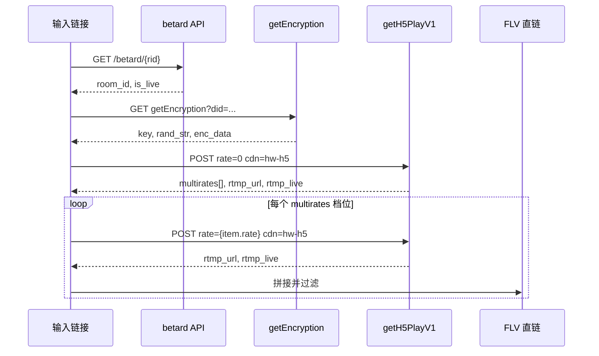

# 斗鱼链接转换说明

本文只讲一件事：**如何把斗鱼房间链接，转换成可直接播放的 FLV 直链**。

实现代码：`resolve_douyu.py` → `resolve_douyu_cdn()`。底层 HTTP 由 streamget 的 `DouyuLiveStream` 完成。

---

## 1. 输入与输出

### 1.1 支持的输入

| 输入 | 规范化结果 |
|------|------------|
| `5720533` | `https://www.douyu.com/5720533` |
| `https://www.douyu.com/5720533` | 原样 |
| `www.douyu.com/5720533` | `https://www.douyu.com/5720533` |

规范化函数：

```python
def normalize_url(value: str) -> str:
    text = value.strip()
    if text.isdigit():
        return f"https://www.douyu.com/{text}"
    if not text.startswith("http"):
        return f"https://{text}"
    return text
```

### 1.2 输出（每一档一条直链）

```
https://{cdn_host}/live/{room_id}{stream_key}[_{bitrate}].flv?wsAuth=...&token=...&...
```

以房间 **5720533** 为例，转换结果 4 条：

| 档位 | 最终直链中的 FLV 文件名 |
|------|-------------------------|
| 原画1080P60 | `5720533rCEgXgVzL.flv` |
| 蓝光4M | `5720533rCEgXgVzL_4000.flv` |
| 超清 | `5720533rCEgXgVzL_2000.flv` |
| 高清 | `5720533rCEgXgVzL_900.flv` |

`wsAuth`、`token` 等查询参数**每次请求都会变**，不能缓存太久；**流文件名**在同一场直播内稳定，可用于对比验证。

---

## 2. 转换总览（四步）

```
房间链接
  │ ① 提取 rid、确认开播
  ▼
房间号 rid
  │ ② 拿白名单 → 算 auth
  ▼
签名参数 enc_data + auth
  │ ③ POST getH5PlayV1（按档位 rate）
  ▼
rtmp_url + rtmp_live
  │ ④ 拼接 + 过滤 douyucdn
  ▼
FLV 直链（可给 flv.js / VLC）
```



---

## 3. 第一步：房间链接 → 房间号 rid

**请求**

```http
GET https://www.douyu.com/betard/5720533
Referer: https://www.douyu.com/
User-Agent: Mozilla/5.0 ...
```

**从响应取**

```json
{
  "room": {
    "room_id": 5720533,
    "nickname": "主播名",
    "show_status": 1
  }
}
```

**转换规则**

| 字段 | 用法 |
|------|------|
| `room_id` | 后续所有 API 的 `rid` |
| `show_status == 1` | 视为可解析（开播或轮播）；否则**终止**，不继续转换 |
| `nickname` | 仅展示，不参与链接拼接 |

若输入是短链或路径名（非纯数字），streamget 会先请求 `m.douyu.com` 页面，用正则 `"rid":(\d+)` 提取 rid。

---

## 4. 第二步：rid → 签名参数（auth）

每次调用 `getH5PlayV1` 前都要重新拿白名单并计算 `auth`。

**请求**

```http
GET https://www.douyu.com/wgapi/livenc/liveweb/websec/getEncryption?did=10000000000000000000000000001501
```

**响应示例（字段名）**

```json
{
  "error": 0,
  "data": {
    "key": "...",
    "rand_str": "...",
    "enc_time": 3,
    "enc_data": "...",
    "is_special": false
  }
}
```

**计算 auth（与 streamget 源码一致）**

```python
import hashlib, time

ts = int(time.time())
secret = white["rand_str"]
salt = f"{rid}{ts}" if not white["is_special"] else ""

for _ in range(white["enc_time"]):
    secret = hashlib.md5((secret + white["key"]).encode()).hexdigest()

auth = hashlib.md5((secret + white["key"] + salt).encode()).hexdigest()
```

**产出**：`enc_data`、`auth`、`tt`（时间戳）、`did`（固定设备 ID），供下一步 POST 使用。

---

## 5. 第三步：rid + rate → getH5PlayV1 原始字段

这是链接转换的**核心**：API 返回的两个字段拼成最终 URL。

**请求**

```http
POST https://playweb.douyucdn.cn/lapi/live/getH5PlayV1/5720533
Content-Type: application/x-www-form-urlencoded
Origin: https://www.douyu.com
Referer: https://www.douyu.com/

rate=0&ver=219032101&iar=0&ive=0&rid=5720533&hevc=0&fa=0&sov=0
&enc_data={enc_data}&tt={ts}&did=10000000000000000000000000001501
&auth={auth}&cdn=hw-h5
```

**关键 POST 参数**

| 参数 | 值 | 说明 |
|------|-----|------|
| `rid` | 房间号 | 与 betard 一致 |
| `rate` | 见 multirates | **档位码，必须从 API 返回的 `multirates[].rate` 读取**，不要硬编码 |
| `cdn` | `hw-h5` | 固定华为 H5 线路，对应 `cdnsWithName` 里的「线路7」 |
| `ver` | `219032101` | H5 客户端版本号 |
| `did` | `10000000000000000000000000001501` | 设备 ID |
| `enc_data` / `auth` / `tt` | 上一步算出 | 防盗链签名 |

**响应 `data` 中与链接相关的字段**

```json
{
  "rtmp_url": "https://hw3.douyucdn2.cn/live",
  "rtmp_live": "5720533rCEgXgVzL.flv?wsAuth=xxx&token=web-h5-0-5720533-...&logo=0&expire=0&did=...&ver=219032101&pt=2&st=0&sid=...",
  "rtmp_cdn": "hw-h5",
  "multirates": [
    { "name": "原画1080P60", "rate": 0, "bit": 12100 },
    { "name": "蓝光4M",     "rate": 4, "bit": 4000 },
    { "name": "超清",       "rate": 3, "bit": 2000 },
    { "name": "高清",       "rate": 2, "bit": 900 }
  ],
  "cdnsWithName": [
    { "name": "线路7", "cdn": "hw-h5" }
  ]
}
```

注意：`rate` 与显示名**不是**简单的 0/1/2/3 映射。上例中蓝光对应 `rate=4`，必须以 `multirates` 为准。

---

## 6. 第四步：原始字段 → FLV 直链（拼接公式）

**唯一拼接规则**

```python
def flv_url(rtmp_url: str, rtmp_live: str) -> str:
    return f"{rtmp_url}/{rtmp_live}"
```

**拆解示例**

```
rtmp_url  = https://hw3.douyucdn2.cn/live
rtmp_live = 5720533rCEgXgVzL_900.flv?wsAuth=...&token=...&did=...&ver=219032101&...
                    └─ 路径部分 ─┘ └──────────── 查询参数（签名）────────────┘

最终直链 = https://hw3.douyucdn2.cn/live/5720533rCEgXgVzL_900.flv?wsAuth=...&token=...
```

### 6.1 URL 各部分含义

| 部分 | 示例 | 说明 |
|------|------|------|
| 协议 + CDN 主机 | `https://hw3.douyucdn2.cn` | 节点由斗鱼分配，可能为 hw1/hw2/hw3 等 |
| 路径前缀 | `/live/` | 固定 |
| 房间 + 流密钥 | `5720533` + `rCEgXgVzL` | 房间号 + 本场流 ID |
| 码率后缀 | `_4000` / `_2000` / `_900` | 有后缀表示转码档；无后缀多为原画 |
| 扩展名 | `.flv` | H5 线路输出 FLV |
| `wsAuth` | 每次不同 | CDN 鉴权 |
| `token` | `web-h5-0-{rid}-...` | 斗鱼 H5 token |
| `did` / `ver` / `sid` 等 | 固定或会话级 | 客户端标识 |

### 6.2 多档转换循环

先用 `rate=0` + `cdn=hw-h5` 调一次，拿到 `multirates` 列表；再**对每个档位**用其 `rate` 重复调用 `getH5PlayV1`：

```python
streams = []
seen = set()

for item in multirates:
    rate = str(item["rate"])
    name = item["name"]

    resp = await fetch_h5_play(rid, rate=rate, cdn="hw-h5")
    data = resp["data"]

    url = f"{data['rtmp_url']}/{data['rtmp_live']}"

    # 只要 douyucdn，不要 edgesrv P2P
    if "douyucdn" not in url or "edgesrv.com" in url:
        continue

    basename = url.split("?")[0].split("/")[-1]
    if basename in seen:
        continue
    seen.add(basename)

    streams.append({"name": name, "url": url})
```

### 6.3 必须丢弃的链接

`getH5PlayV1` 有时返回 **edgesrv P2P** 地址（域名含 `edgesrv.com`）。这类链接：

- 不能按上述公式在浏览器里直接播；
- 本项目**直接跳过**，只保留 `*.douyucdn*.cn`。

---

## 7. 完整手工示例（5720533）

```
输入: 5720533

Step 1  betard/5720533
        → rid=5720533, is_live=true

Step 2  getEncryption
        → enc_data=..., auth=...（本次有效）

Step 3a getH5PlayV1 rid=5720533 rate=0 cdn=hw-h5
        → multirates 共 4 档
        → 原画 rtmp_live 含 5720533rCEgXgVzL.flv

Step 3b 对 rate=0,4,3,2 各请求一次，每次得到不同 rtmp_live：

        原画: .../5720533rCEgXgVzL.flv?wsAuth=...
        蓝光: .../5720533rCEgXgVzL_4000.flv?wsAuth=...
        超清: .../5720533rCEgXgVzL_2000.flv?wsAuth=...
        高清: .../5720533rCEgXgVzL_900.flv?wsAuth=...

输出: 4 条 FLV 直链，交给播放器 GET 拉流
```

**验证直链是否有效**（可选）：对 URL 发 GET，响应体前 4 字节应为 `FLV`（`0x46 0x4C 0x56`）。

---

## 8. 与本项目 JSON 的对应关系

`resolve_douyu_cdn` 返回结构中，**可直接播放的字段**：

```json
{
  "streams": [
    {
      "name": "高清",
      "lines": [
        {
          "name": "线路7",
          "url": "https://hw3.douyucdn2.cn/live/5720533rCEgXgVzL_900.flv?wsAuth=..."
        }
      ]
    }
  ],
  "play_url": "同上，默认档（优先含「高清」）",
  "flv_url": "同 play_url"
}
```

| 你要用的 | 取哪个字段 |
|----------|------------|
| 指定清晰度 | `streams[i].lines[0].url` |
| 默认播放 | `play_url` 或 `flv_url` |
| 判断是否同一场流 | URL 路径中的 `.flv` 文件名（去掉 `?` 后） |
| 判断是否需要重新解析 | 播放 403 / 断流 → 重新跑一遍转换拿新 `wsAuth` |

---

## 9. 快速调用

```powershell
cd live/server

# 转换并打印各档 FLV 文件名
.\.venv\Scripts\python resolve_douyu.py 5720533

# 可选导出 JSON（streams[].lines[].url 即为最终直链）
.\.venv\Scripts\python resolve_douyu.py 5720533 --out result.json
```

HTTP：

```
GET http://127.0.0.1:8765/api/room?site=douyu&room=5720533&source=local
```

响应里 `streams[].lines[].url` 就是转换后的直链，**无需再加工**，浏览器 flv.js 或 VLC 直接打开。

---

## 10. 常见问题

**Q：能不能从房间号直接猜 FLV 地址？**  
不能。`rCEgXgVzL` 流密钥和 `wsAuth`/`token` 都必须通过 API 实时获取。

**Q：换清晰度要改什么？**  
只改 `getH5PlayV1` 的 `rate`（取 `multirates` 对应项），CDN 主机和流密钥前缀通常不变，变的是文件名后缀（`_900`、`_2000` 等）。

**Q：两条直链的 FLV 文件名相同但 `wsAuth` 不同，是同一流吗？**  
是。签名参数每次请求都会刷新，对比时只比文件名。

**Q：为什么固定 `cdn=hw-h5`？**  
该线路返回 douyucdn 直链，浏览器可播；其他 CDN 可能落到 edgesrv P2P。

---

## 参考代码

| 位置 | 内容 |
|------|------|
| `resolve_douyu.py` → `_flv_from_api_data` | `rtmp_url + "/" + rtmp_live` |
| `resolve_douyu.py` → `resolve_douyu_cdn` | 多档循环 + douyucdn 过滤 |
| `streamget/.../douyu/live_stream.py` → `_fetch_web_stream_url` | getH5PlayV1 请求与 auth |
| `compare_streams.py` → `flv_basename` | 从直链提取文件名用于对比 |
